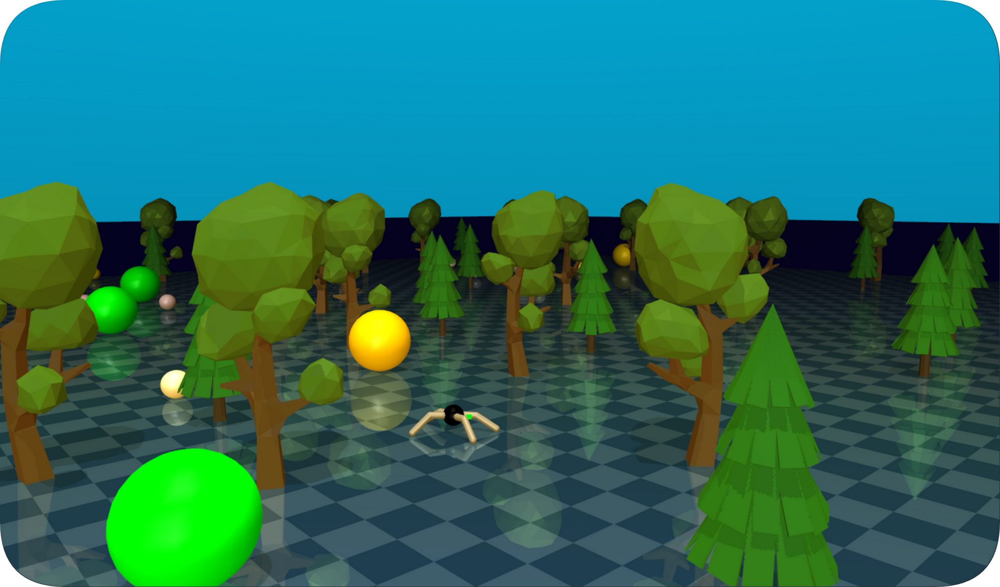

# PITA (Procedural and Iterative Terrain Assembly)


Welcome to the documentation for PITA (Procedural and Iterative Terrain Assembly), a framework designed to generate dynamic and customizable environments for reinforcement learning (RL) in MuJoCo. PITA serves as a valuable tool for creating varied simulation environments, helping to mitigate overfitting in AI systems by providing diverse training scenarios.

Introduction
------------

AI systems require exposure to a variety of environments to develop robust and adaptable behaviors. Static, unchanging environments can lead to overfitting, where AI agents perform well in familiar scenarios but struggle with any variation. PITA addresses this challenge by generating multiple variations of the same environment, in which the properties and positions of objects can be altered. This is achieved through randomization, over which the user has control, allowing for a more dynamic and adaptable testing scenario.

Core Features
---------------

- **XML Input**: The system uses XML files as inputs, enabling users to supply custom assets by passing the directory of the xmls to PITA.

- **Fine-Grained Configuration Control**: Offers detailed control over the placement and properties of assets, with the additional capability to randomize these aspects as required.

- **Property Randomization**: Offers the ability to randomize various properties of every asset, including position, number, colors, sizes, and z-axis rotation.

- **Adjustable Environment Sizes**: Supports variable environment dimensions while also including the option to randomize length and height.

- **Segmented Environmental Areas**: Allows the division of the overall environment into multiple equal-sized areas. Object behavior, such as position randomization, is then based on the area they are positioned in.

- **Distribution-Based Randomization**: Implements position randomization through statistical distributions, providing users with the option to select specific distribution models for each asset to achieve desired randomness effects.

- **Runtime Validation of Asset Positioning**: Ensures that all assets are correctly positioned without overlaps through validation at run-time.

- **Placement Rules**: Allows setting specific rules for asset placement, such as maintaining a minimum distance between objects.

- **Diverse Asset Pool**: Enables the definition of an asset pool, allowing selection from various assets of a similar style (e.g., "Tree.xml", "Tree_Birch.xml", "Tree_Ahorn.xml").

- **YAML Configuration**: Simplifies the environment setup process through YAML configuration files, eliminating the need for direct coding and making the system accessible to users with minimal programming experience.

- **JSON Output**: Generates a JSON file detailing information about the objects within the environment, providing a structured output that can be used for the environment dynamics.


Why PITA?
---------

PITA offers several advantages for the development and training of RL systems:

- **Aimed for RL and MuJoCo**: PITA is specifically designed for reinforcement learning scenarios using the MuJoCo framework, known for its complex interactions. PITA simplifies the use of MuJoCo by allowing users to integrate custom assets and define settings through a straightforward configuration file, effectively streamlining the complexity of the environment setup.
- **Mitigates Overfitting**: By generating varied environments of the same setup, the agent has to develop a deeper understanding of the environment and the task at hand.
- **Rapid Prototyping**: The easy-to-use configuration system speeds up the process of environment generation.

PITA provides a framework for the procedural and iterative assembly of training environments, designed to support reinforcement learning research. It offers researchers and developers the tools needed to construct diverse and challenging scenarios, aiding in the development of AI agents that can perform well across different tasks.

## Installation

```bash
# Clone the PITA repository
git clone [https://github.com/YourGitHub/pita.git](https://github.com/microcosmAI/pita.git)
cd pita

# (Optional) Create and activate a virtual environment
python -m venv pita-env
source pita-env/bin/activate  # For Windows use `pita-env\Scripts\activate`

# Install dependencies
pip install -r requirements.txt
```

## Quick Start

```shell
# Run PITA with the default configuration
python pita_algorithm/pita.py 
```
The script uses the configuration example yml files in the examples/config_files directory and generates .json and .xml files in the export directory.

`.xml` file created by `pita.py` in the export directory could be used for the Mujoco environment.   

### Example for running on Mujoco

To run the simulation on Mujoco, use the appropriate script for your operating system. Replace [YOUR_OS] in the command below with osx, linux, or win

```shell
sh run_[YOUR_OS].sh 
```

This script uses the configuration from `examples/config_files` to generate environments in `.json` and `.xml` formats, stored in the `export` directory.

## Example configuration file
```
Environment:
  size_range: [100, 100]

  random_seed: 42

  Style:
    - pretty_mode: False

  Borders:
    - xml_name: "Border.xml"
    - place: True
    - tags: ["Border"]

  Objects:
    Tree01:
      - xml_name: "Tree01.xml"
      - amount: [2, 2]

    Agent:
      - xml_name: "BoxAgent.xml"
      - amount: 2
      - coordinates: [ [10, 10, 3], [10, 30, 3] ]

Areas:
  Area1:
    Objects:
      Tree02:
        - xml_name: "Tree02.xml"
        - amount: [2, 2]
        - tags: ["Tree"]
```
